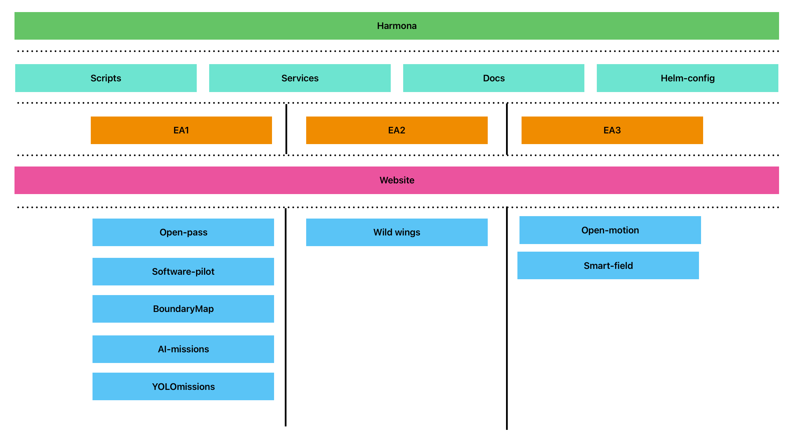

# Harmona

<!-- Badges Section - FILL IN YOUR ACTUAL VALUES -->
[](LICENSE)
[](https://github.com/[YOUR_USERNAME]/[REPO_NAME]/releases)

<!-- FILL IN: Brief description of what OpenPass does -->
Harmona is an opensource platform for Edge to Cloud AI-Driven Applications for Field Studies



## Table of Contents
- [Installation](#installation)
- [Quick Start](#quick-start)
- [Contributing](#contributing)
- [License](#license)
- [Acknowledgments](#acknowledgments)

## Installation

### Prerequisites

<!-- FILL IN: List all requirements -->
- Ubuntu (22.01 or higher)
- Libraries using apt-get: bash, curl, python3, git, and docker.
- Hardware: at least (1) 4 1.2 Ghz CPU cores, (2) 8 GB Ram, and (3) 256 GB storage.
- Parrot Anafi Drones


## Quick Start

```bash
bash /scripts/setup/startMicroservice.sh
```

## Contributing

We welcome contributions! Please see our [Contributing Guidelines](CONTRIBUTING.md) for details.

### Code Standards
- Follow [CODING_STANDARD - e.g., "ESLint configuration"]
- Write tests for new features
- Update documentation for each implementation
- Use conventional commits: `feat:`, `fix:`, `docs:`, `style:`, `refactor:`, `test:`, `chore:`

## Support

<!-- FILL IN: Support information -->
- 📧 **Email:** cstewart@cse.ohio-state.edu
- 🐛 **Bug Reports:** [Create an issue](https://github.com/vedantpatil2021/Harmona/issues)
- 💡 **Feature Requests:** [Create an issue](https://github.com/vedantpatil2021/Harmona/issues)
- 📖 **Documentation:** [LINK](https://icicle-ai.github.io/training-catalog/)

## License

This project is licensed under the MIT License - see the [LICENSE](LICENSE) file for details.

## Acknowledgments

<!-- FILL IN: Credits and acknowledgments -->
- [ACKNOWLEDGMENT_1 - e.g., "Thanks to [LIBRARY/PERSON] for [CONTRIBUTION]"]
- [ACKNOWLEDGMENT_2]
- [ACKNOWLEDGMENT_3]

---

**⭐ If you find this project helpful, please consider giving it a star!**

**🤝 Contributions are welcome! Please read our [contributing guidelines](CONTRIBUTING.md) before submitting a PR.**